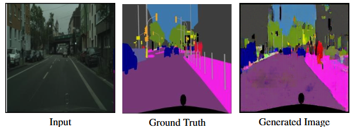

# Image-to-Image Translation with GAN

A deep learning project that uses Conditional Generative Adversarial Networks (GANs) to perform various image-to-image translations, including:
- Satellite images to maps
- Cityscape photos to semantic segmentation
- Shoe sketches to photorealistic images
- Anime sketches to colorized images

## Examples

### Edge to Shoes Translation

Transform simple shoe outlines into photorealistic shoe images.

### Cityscape Semantic Segmentation

Convert urban photographs into semantic segmentation maps.

### Satellite to Map Translation

Transform satellite imagery into map representations.

### Anime Sketch Colorization

Convert black and white anime sketches into fully colorized images.

## Features
- Multiple domain translations supported in a single application
- User-friendly Flutter interface
- Real-time image processing
- High-quality image transformations

## Technical Architecture
- **Frontend**: Flutter application
- **Backend**: FastAPI server
- **Model**: PyTorch-based Conditional GAN
- **Training Platform**: Google Colab

## Model Architecture
- Generator: U-Net based architecture with skip connections
- Discriminator: PatchGAN discriminator
- Loss Functions: Combination of adversarial loss and L1 loss

## Requirements

### Hardware
- GPU for training (Google Colab GPU runtime recommended)
- Standard hardware for running the Flutter application

### Software
- Python 3.8+
- PyTorch
- Flutter SDK
- FastAPI
- Firebase (for authentication)

## Installation

1. Clone the repository:
```bash
git clone https://github.com/yourusername/image-translation-gan.git
cd image-translation-gan
```

2. Install Python dependencies:
```bash
pip install -r requirements.txt
```

3. Install Flutter dependencies:
```bash
cd flutter_app
flutter pub get
```

4. Configure Firebase:
   - Create a new Firebase project
   - Add your Firebase configuration to the Flutter app
   - Enable Authentication in Firebase console

## Usage

1. Start the FastAPI server:
```bash
cd backend
uvicorn main:app --reload
```

2. Run the Flutter application:
```bash
cd flutter_app
flutter run
```

3. Access the application:
   - Open the app on your device
   - Sign in using your credentials
   - Upload an image
   - Select the desired translation type
   - View and save the results

## Training

To train the model on your own dataset:

1. Prepare paired images in the required format
2. Configure training parameters in `config.py`
3. Run the training script:
```bash
python train.py --dataset_path /path/to/dataset --model_type [cityscape|shoes|map|anime]
```

## Results

The model was trained on multiple datasets with the following specifications:
- Edge2Shoes: 16 epochs
- Cityscapes: 500 epochs
- Map to Satellite: 500 epochs
- Anime Colorization: 500 epochs

Loss curves and sample results are available in the `results` directory.

## Limitations
- Requires paired image datasets for training
- Computationally intensive training process
- Performance depends on quality of input images

## Future Enhancements
- Dataset expansion
- Additional translation domains
- Interactive editing features
- User feedback integration
- Style transfer capabilities


## License
This project is licensed under the MIT License - see the [LICENSE](LICENSE) file for details.

## Acknowledgments
- Department of Computer Science and Engineering, Kathmandu University
- Project Supervisor: Mr. Nabin Ghimire
- Special thanks to Mr. Dhiraj Shrestha for providing access to Active Learning Lab